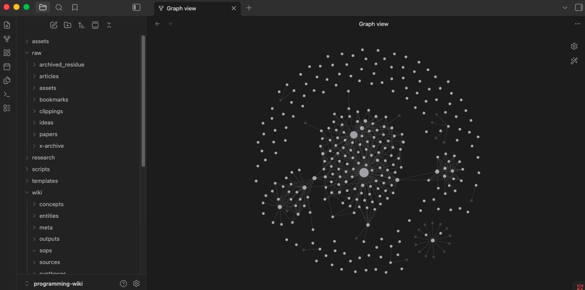

# CS Wiki

This wiki is an implementation of [shannhk's llm wiki repository](https://github.com/shannhk/llm-wikid.git), which is an AI-maintained knowledge base that lives in Obsidian. This one is a computer-science wiki.

Check the original repository's README to know more and how to get started with your own wiki. But basically you dump a lot of resources, run some commands to let AI do its work and then you open the folder in Obsidian.

There's a little script to extract pdfs here, `extract_pdf.py`, that can come handy, besides the main repo itself. In the `/raw` folder you can find a lot links, articles. Then you have `/wiki` folder where you can find everything chewep up. For easy navigation just check the graph view. 

The wiki was built with a really big dump of text and links related to CS. It certainly begins messy but with time you can polish it and end up with something good.

